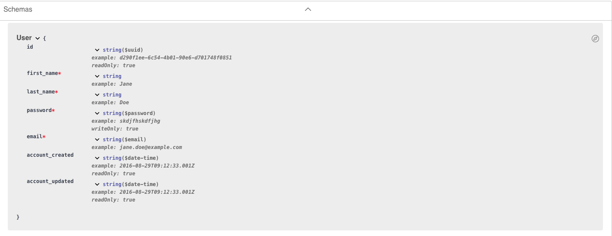

# CSYE6225 : Cloud Computing and Network Structures
Semester: FALL 2024 

---

Building a Cloud Native Web Application: 

- Server Operating System: Ubuntu 24.04 LTS
- Programming Language: Python
- Relational Database: PostgreSQL
- Backend Framework: Flask
- ORM Framework: Python with SQLAlchemy

---

## Table of Contents
- [Objective](#objective)
- [Run the project locally](#run-the-project-locally)
    - [Prerequisites](#prerequisites)
    - [Setting Up PostgreSQL Database](#setting-up-postgresql-database)
    - [Clone the Repository](#clone-the-repository)
    - [Running the Flask App Locally](#running-the-flask-app-locally)
    - [Testing the API with Postman](#testing-the-api-with-postman)
- [Run the project on a VM](#run-the-project-on-a-vm)
    - [Prerequisites](#prerequisites)
    - [Create a VM instance](#create-a-vm-instance)
    - [Source code transfer](#source-code-transfer)
    - [Run the setup script](#run-the-setup-script)
    - [DB Bootstrap](#db-bootstrap)
    - [API Routes and Methods](#api-routes-and-methods)
- [Branching and Merging Strategy](#branching-and-merging-strategy)

---

## Objective

The objective of this project is to select a technology stack for a backend (API only) Web Application and implement Restful APIs. So far, the project is built locally and on an Ubuntu 24.04 LTS VM.  

---

## Run the project locally

This section covers the setup required to run the Flask API locally.

#### Prerequisites

- Git 2.46.0 or higher
- Python 3.8 or higher
- `pip`
- PostgreSQL 16.4 or higher
- `venv` Virtual Environment is used to build the app locally
- Postman

#### Setting Up PostgreSQL Database

- Install PostgreSQL locally (for MacOS) - https://www.postgresql.org/download/macosx/
- Once installed, make sure the server is configured & RUNNING.
- Create a database, user and note down the connection credentials and database details.
   ```sql
   CREATE DATABASE your_db_name;
   CREATE USER 'your_db_user' WITH ENCRYPTED PASSWORD 'your_password';
   GRANT ALL PRIVILEGES ON DATABASE your_db_name TO your_db_user;
   ```

#### Clone the Repository

1. Clone this repository to your local machine. (Assuming git is configued. Preferably with SSH):
    ```bash
    git clone git@github.com:CSYE-6225-shalom/webapp.git
    cd webapp
    ```
2. Set up the `.env` file with your environment variables in the root of the repo:
    ```env
    DB_NAME=your_db_name
    DB_USER=your_db_user
    DB_PASSWORD=your_db_password
    DB_HOST=localhost
    DB_PORT=5432
    PORT=8081
    DEBUG_MODE=True
    ```
3. Folder structure locally should now look like: 

```bash
WEBAPP
├── app
│   ├── utils
│   │   └── http_codes.py
│   └── app.py
├── .env
├── .gitignore
├── README.md
├── requirements.txt
└── setup.sh
```

#### Running the Flask App Locally

- Run the `scripts/setup.sh` script to create a virtual environment, activate it & install all dependancies needed to run the app. The setup.sh script will also run the Flask app, if there are no errors during the setup.
    ```bash
    source scripts/setup.sh
    ```
- The app can be set to Debug mode to reflect any change made to the application without needing a restart. Set ```DEBUG_MODE = True``` in the ```.env``` file.
    - NOTE: if you make changes to the `.env` file while the app is running, you will need to stop & restart the app to reflect changes made to the `.env` file. This is because, the Flask app reads the environment variables during the initialization phase. These variables are loaded into the environment at the start. 
- Now, you can proceed with testing the endpoints and connection with the database using Postman.

#### Testing the API with Postman

- Health Check Endpoint Test
    - Method: GET
    - Path: `/healthz`
    - URL: http://127.0.0.1:8081/healthz
    - All API request responses will be in JSON format.
        - Expected Response:
            - Status Code: 200 OK (if the database is connected successfully).
            - Status Code: 503 Service Unavailable (if there is an issue connecting to the database).
            - Status Code: 400 Bad Request (if you send a request body to this endpoint).
            - Status Code: 405 Method Not Allowed (if you send a request other than `GET` method to this endpoint).
            - Status Code: 404 Not Found (if you send a request that doesnt match the expected url).

---

## Run the project on a VM

This section covers the setup required to run the Flask API on a Digital Ocean droplet which is running on an Ubuntu 24.04 LTS operating system.

#### Prerequisites

- Python 3.8 or higher
- PostgreSQL 16.4 or higher 
- Digital Ocean VM (Droplet) Ubuntu 24.04 LTS
- Postman

#### Create a VM instance

- For this project, Digital Ocean VM is used. 
- A 'Basic' droplet with Regular CPU, 1vCPU is used to build the app. 
- OS: Ubuntu 24.04 LTS
- Estimated costs: 4$/month
- Pricing and specs: https://www.digitalocean.com/pricing/droplets#basic-droplets
- Configure SSH locally and on Digital Ocean to access the VM. 
- (Optional) Create a config file inside the `~/.ssh` folder to manage multiple SSH keys locally. 
    - Use below code and replace values
        ```bash
        Host <alias name>
            HostName <ip address>
            User root (by default)
            IdentityFile <private ssh key path>
        ```

#### Source code transfer

- `cd` into the directory where the source code zip resides on the local machine. 
- run the command, replaced with actual values
    `scp /<filename>.zip <vm-name>:/root/ `
- After running the command, you will prompted with entering the passphrase configured. 
- Cross check whether file was copied to VM inside the `root` directory.
- To unzip the zip file and access the source code, you will need to manually install `unzip` on the VM. 
    `ap install unzip`
- Run `unzip <filename.zip>`

#### Run the setup script

- `cd` into the source code directory.
- Create an `.env` config file to contain all config properties for the Flask app & copy your configuration.
- Locate & run the `vm_setup.sh` script to setup the entire project and install necessary dependancies in order to run the project from scratch.
    - The script checks and installs Python, pip, PostgreSQL, creates a PostgreSQL user, sets up a Python virtual environment & activates it and installs all application dependencies from the `requirements.txt` file.
- At this point, the flaskapp can be run and tested. 
- (Optional) To login into the newly created DB with the newly created user, you may have to ensure the authentication is changed from 'peer' to 'md5' in the `pg_hba.conf` file.
    - Reference: https://stackoverflow.com/questions/18664074/getting-error-peer-authentication-failed-for-user-postgres-when-trying-to-ge
    - `cd /etc/postgresql/16/main/`
    - `nano pg_hba.conf`
    - Change authentication from peer to md5
    - `sudo systemctl restart postgresql`
    - Now, you should be able to login with the new user to access the tables in the db

#### DB Bootstrap

- Inside the `utils` folder, the `db_init.py` initializes a database & creates a `users` table for the application based on the properties specified in `models.py` file.
- `users` table schema: 


#### API Routes and Methods

- Swagger Docs: https://app.swaggerhub.com/apis-docs/csye6225-webapp/cloud-native-webapp/2024.fall.a02#/public/post_v1_user
    - /healthz (GET): A health check endpoint that verifies the database connection.
        - 200: Database is reachable.
        - 400: Bad request.
        - 503: Database is unavailable or fails to connect.
        - 500: Other errors.

    - /v1/user (POST): A user creation endpoint that processes POST requests to create a new user.
        - 201: User creation was successful.
        - 400: Bad request.
    
    - /v1/user/self (GET): An endpoint to retrieve the current user's information.
        - 200: Successfully retrieves the user's information.
        - 400: Bad request.
        - 401: Unauthorized access if the user is not authenticated.
        - 404: User not found.

    - /v1/user/self (PUT): An endpoint to update the current user's information.
        - 204: Successfully updates the user's information.
        - 400: Bad request.
        - 401: Unauthorized access if the user is not authenticated.
        - 404: User not found.


## Branching and Merging Strategy

This repository is created in a Github Organization & follows a **forking workflow**. All development occurs in the forked repository, with changes committed through **Pull Requests (PRs)** from the forked repository into the `main` branch of the main repository. Key guidelines:

1. Fork the main repository to your GitHub account.
2. Create feature branches in your fork for each change or feature (e.g., `feature/my-new-feature`).
3. Commit your changes to the feature branch.
4. Submit a PR from your fork's feature branch to the `main` branch of the main repository.
5. PRs must be reviewed and approved before merging into the `main` branch.

---
